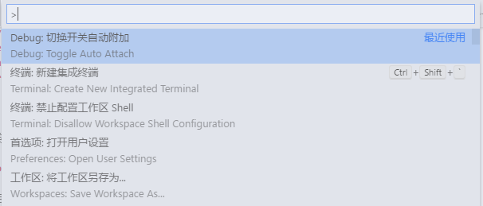
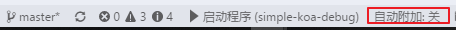

# 演示

```
yarn install
```
or
```
npm install
```

1.  打断点
2.  F5(选择 `启动程序(simple-koa)`)
3.  请求 http://localhost:10086

# Attach 调试

launch 调试,即调试时自动启动应用

``` JSON
{
    "type": "node",
    "request": "launch",
    "name": "启动程序",
    /* 可以把index.js改为${file},即调试当前打开的文件,但一般koa应用都是从一个入口启动的 */
    "program": "${workspaceFolder}\\index.js", 
},
```

还有一类时Attach,即调试已经启动的应用,在vscode中有两种方式使用这类调试

## Auto Attach

在vs中启动自动附加 

1.通过命令面板(F1)  



2.通过状态栏按钮  



自动附件模式下,vscode会检查后续启动进程的参数是否有`--inspect`, `--inspect-brk`, `--inspect-port`, `--debug`, `--debug-brk`, `--debug-port`,`--debug-port=端口`

启动后开始调试

```
node --inspect .\index.js
```

## "Attach" configuration

使用另一种调试配置,注意下面的request是attach
```
{
    "type": "node",
    "request": "attach",
    "name": "Attach via default debug port",
    "port": 9229
}
```
port是调试的默认端口

1. 启动应用`node --inspect .\index.js`
2. 在调试面包选择`Attach via default debug port`F5启动调试

你可以指定端口号(`node --inspect=12345 .\index.js`),但要确保与调试配置中`port`一样
你也可以不通过端口附件,可以通过进程Id(被调试的node进程可以是不在调试模式的)

```
{
    "name": "Attach to Process",
    "type": "node",
    "request": "attach",
    "processId": "53426"
}
```

processId可以改为`${command:PickProcess}`这样启动调试时,vscode会让你从现在运行的进程中选择一个进程的进程Id
